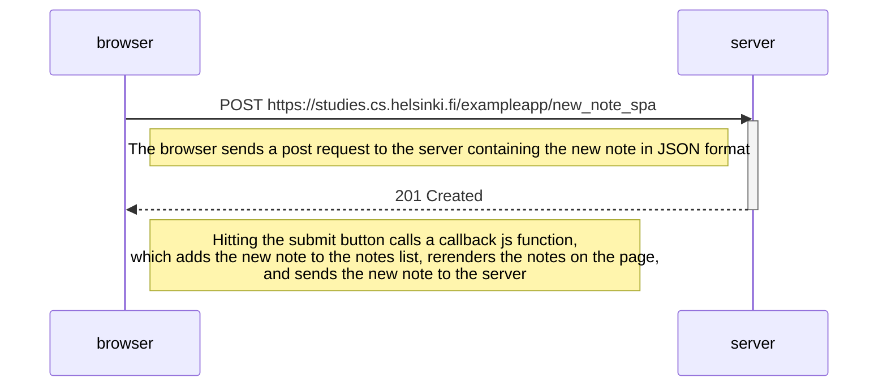

```mermaid
sequenceDiagram
  participant browser
  participant server

  browser->>server: POST https://studies.cs.helsinki.fi/exampleapp/new_note_spa
  activate server
  Note right of browser: The browser sends a post request to the server containing the new note in JSON format
  server-->> browser: 201 Created
  deactivate server

  note right of browser: Hitting the submit button calls a callback js function, <br> which adds the new note to the notes list, rerenders the notes on the page, <br> and sends the new note to the server

```
