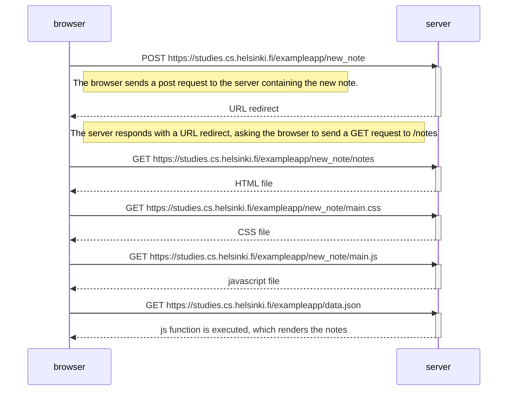

```mermaid
sequenceDiagram
  participant browser
  participant server

  browser->>server: POST https://studies.cs.helsinki.fi/exampleapp/new_note
  activate server
  Note right of browser: The browser sends a post request to the server containing the new note.
  server-->> browser: URL redirect
  deactivate server

  Note right of browser: The server responds with a URL redirect, asking the browser to send a GET request to /notes

  browser->>server: GET https://studies.cs.helsinki.fi/exampleapp/new_note/notes
  activate server
  server-->> browser: HTML file
  deactivate server

  browser->>server: GET https://studies.cs.helsinki.fi/exampleapp/new_note/main.css
  activate server
  server-->> browser: CSS file
  deactivate server

  browser->>server: GET https://studies.cs.helsinki.fi/exampleapp/new_note/main.js
  activate server
  server-->> browser: javascript file
  deactivate server

  browser->>server: GET https://studies.cs.helsinki.fi/exampleapp/data.json
  activate server
  server-->> browser: js function is executed, which renders the notes
  deactivate server

```
