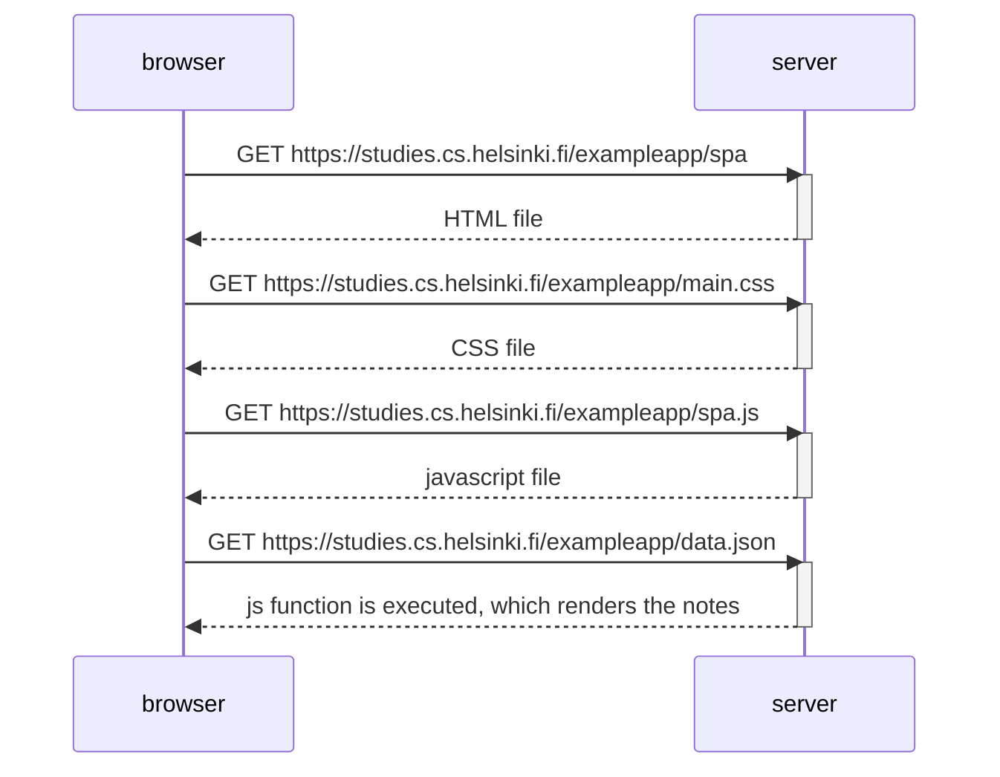

```mermaid
sequenceDiagram
  participant browser
  participant server
  
  browser->>server: GET https://studies.cs.helsinki.fi/exampleapp/spa
  activate server
  server-->> browser: HTML file
  deactivate server

  browser->>server: GET https://studies.cs.helsinki.fi/exampleapp/main.css
  activate server
  server-->> browser: CSS file
  deactivate server

  browser->>server: GET https://studies.cs.helsinki.fi/exampleapp/spa.js
  activate server
  server-->> browser: javascript file
  deactivate server
  
  browser->>server: GET https://studies.cs.helsinki.fi/exampleapp/data.json
  activate server
  server-->> browser: js function is executed, which renders the notes
  deactivate server
  
```
